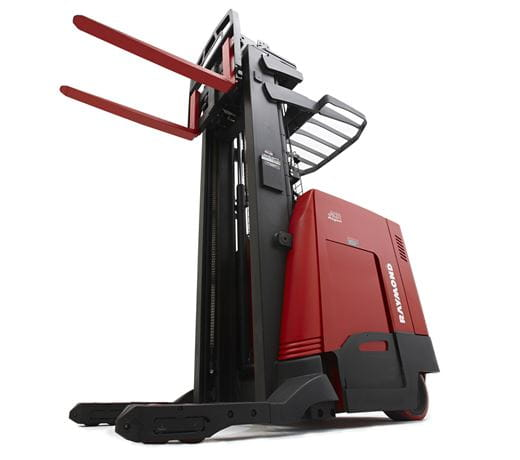
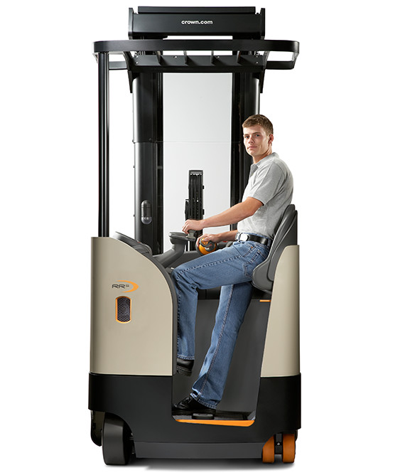
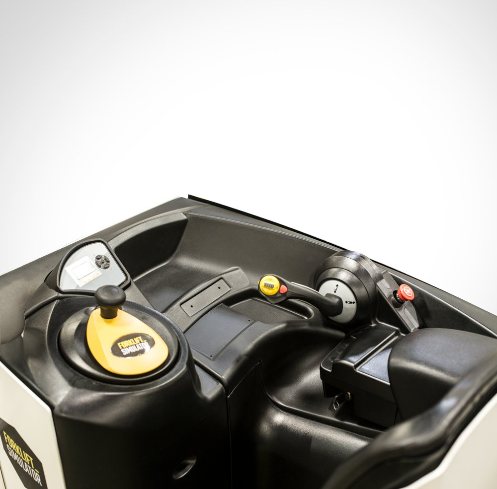
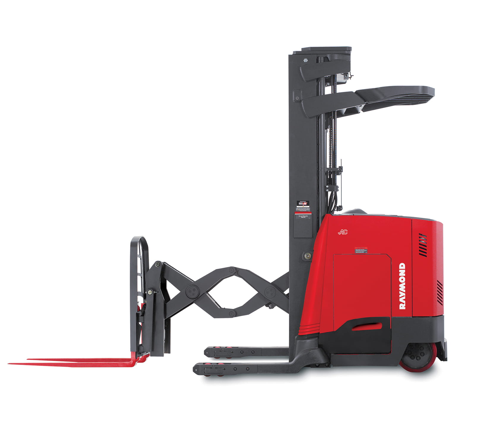

# Reaching a More Usable Lift Truck
By Dylan Wright, October 14th 2022

At my job with Home Depot, we frequently store palletized merchandise in the overheads of narrow aisles. To quickly drop and put up pallets, we employ the use of a couple of [Reach Forklift Trucks](https://www.toyotaforklift.com/resource-library/material-handling-solutions/products/what-is-a-reach-truck), more commonly reffered to as a "reach truck" or simply "reach."

Reach trucks are highly **effective** in taking down palletized merchandise in tight aisles where larger forklifts can't fit thanks to their very tight turning radius. They are also electric, which enables them to be used indoors for extended periods of time without the risk of carbon monoxide emissions or other exhaust emissions polluting the indoor environment.

While there is some variation from truck to truck, most reach trucks operate on similar principles, meaning that having driven a reach truck before, a user can reasonably be expected to be able to operate a reach truck they've never operated. It can be said that driving a reach truck is **memorable**, However upon first inspection, a reach truck does not appear to be very **learnable**.

It is not obviously clear what anything on this control panel does, but you probably don't want someone without licensed supervision to drive one of these machines, so I don't really think this is actually a problem for reach trucks. I think this is one example of technology that is better learned through instruction rather than exploration. That being said, the more you use the reach truck, the better you will understand how it operates.

These are the labeled controls for the reach truck. It still might not operate how you might think, however. It certainly did not for me when I wanted to turn the reach truck. The steering tiller turns the turning wheel located beneath the operator. This means that unlike a car, the back of the reach truck will swing out instead of the front. That part wasn't hard to understand, I had seen the trucks being used before I had operated one, what did throw me off however was that the tiller is not **mapped** to the direction of the wheel. Instead, an indicator on the screen shows you the direction you will move. The tiller can actually be turned infinitely in any direction, but the wheel itself will only rotate in a set 180 degrees.

This isn't the only instance where **natural mapping** would have been useful to make the reach truck more **learnable**. Overall the control handle is pretty well mapped. Moving the joystick up or down makes the cage travel up or down the mast. Tilting the yellow button on the control handle up or down makes the forks tilt upwards or downwards, and tilting it left or right while pressing the auxillary button causes the cage to shift left or right. The truck is moved forward by moving the joystick left and backwards by moving the joystick right. This is somewhat remedied by the fact that the operator usually stands with their body facing the left side of the truck, so to them they are actually moving the joystick forwards or backwards relative to their body, while the truck moves forwards or backwards relative to the direction the truck is facing, which is the direction the operator should also be facing. Moving the cage forwards and backwards is done in the same fashion with the yellow button. 

I believe that had these functions been more **naturally mapped**, it would improve the overall usability of the reach truck for first time drives. I do not believe this is a major issue, more of an inconvience as errors are usually easily recovered from as the operator can realize their action on the controls isn't causing the truck to do the action they want. I also believe that since people perform these tasks as part of their jobs, they can quickly acclimate to the minor differences between how they envision the truck should work and how it actually works by just using the truck. 