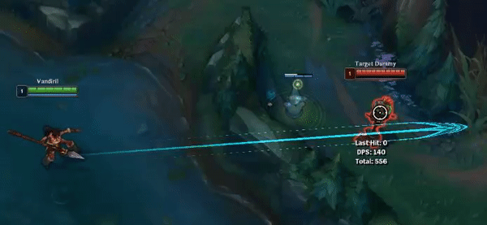
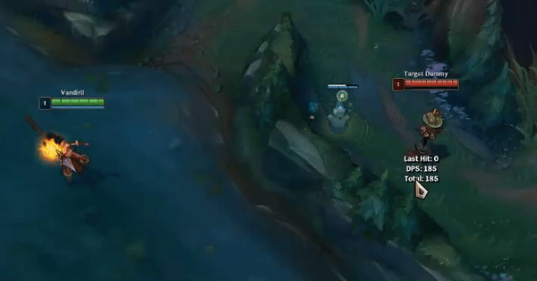
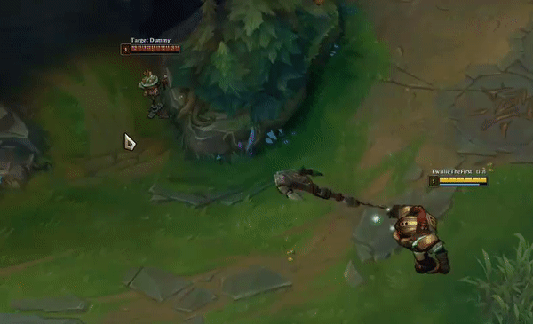
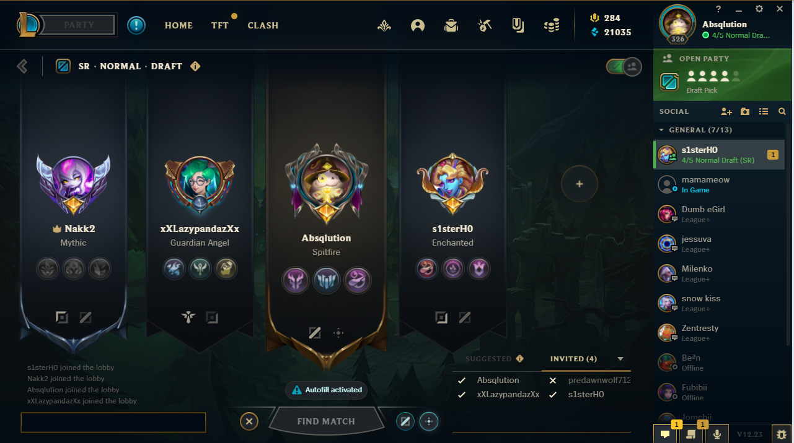
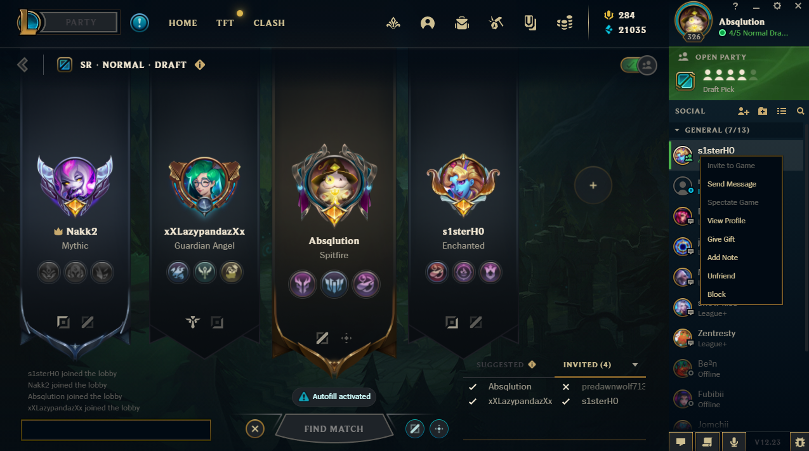
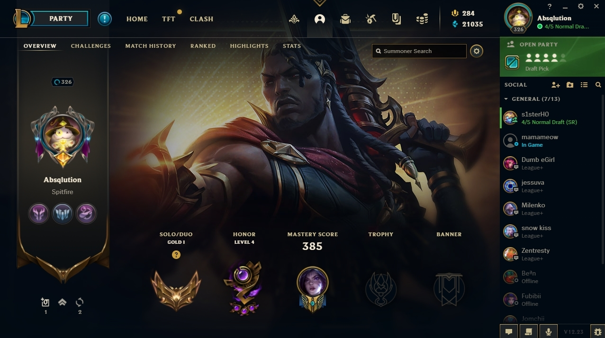

# Riot Games, Small Indie Company
By Dylan Wright, December 15th 2022

## A Brief History

Riot Games, at the time a small indie company, took the idea of a multiplayer online battle arena (MOBA) from a Warcraft 3 mod called Defence of the Ancients (DOTA), and created a separate, standalone game named [League of Legends](https://www.leagueoflegends.com/en-us/). After 4 years of development, a beta was released in April of 2009, with the full game being released in October later the same year with 40 playable characters, called champions.

Having been in a constant state of additive development for the last 13 years, one of the biggest issues facing a game like League of Legends is its learning curve. Now there are 162 champions to choose from, each with up to 5 unique spells and abilities that players must learn to play as and against. And that is just the tip of the iceberg. When analyzing the user experience of League of Legends, mechanics that are lacking in visual clarity or are ambiguous in their actions when lacking a deeper, more experienced knowledge of the game is imperative to keep new players coming.

## Elevation in a Top-Down Perspective

League of Legends is an isometric game played with a helicopter perspective. Basically, this means the game looks 3d but is actually 2d and you play the game as if you are looking down onto it. But that sounds like boring math stuff, so let's play a game: Will this projectile hit?

What about this one?

How does this make any sense? Well the truth requires working knowledge of the game that no new player can reasonably be expected to possess.

In a past update, Riot lowered the river compared to the rest of the map, this elevation difference is the reason for the misleading indicators and projectiles. The indicator is more of an overlay than something that is actually projected onto the terrain of the map. If it were instead to be projected onto the terrain of the map, it would resolve this issue.

Of course, Riot could also just revert the change that lowered the river, and that would also solve the problem. Overall, this experience hurts the game's **learnability**.

## Misleading Hitboxes

After having played a few games of League with or against a Nautilus, you would probably have figured out that his hook cannot hit you through terrain, minions or other ally champions. Champion designs are pretty **memorable** since they are all quite unique. However, believing that you are safe from Nautilus if a minion is between you and him, can result in quite the unfortunate experience. 

Hook champions such as Pyke, Thresh and Nautilus have a misleading hitbox that is referred to as a "lollipop." This is because the hitbox at the end of these hooks is actually larger than when it is travelling. 

This is yet another example of an aspect of the game that requires deeper knowledge of how the game works to understand it. As such, it is another hinderance to the game's **learnability**.

## Client Issues

It would not be a critique of League of Legends if we did not talk about the League client. Since the beginning of time, League players have complained about the constant bugs and **usability** issues of the client. While we could go on and on about all the problems with the League client, I will instead focus on one particularly distasteful aspect of the client.

When in a lobby to queue with other players, one might wish to look at the profile of the people they are about to play with. You would think that an effective way to accomplish this task would be to click on the player and then click on a button such as "view profile" and then be shown their profile, but you would be wrong. Clicking on the big title cards belonging to each player does nothing. There are only 2 ways you can look up a player's profile using the league client. 

The first method is using the friends tab. If the user is a friend, you can find them in your friends list and then view their profile through there. This does not work for viewing profiles of players that are not on your friends list, nor are friends that you are in a party with moved to the top of your friends list.

The second method is by going through your own profile. Not only is this neither **effective** nor immediately clear to a new user, but it also isn't very prominent on the profile page (You can see the search bar on the top right). The search also doesn't offer suggestions, and usernames are case sensitive, so even a small typo will only result in the error message "Could not find a summoner by that name." This is a very poor way of preventing user **errors**.

The problem with both of these methods are that they are neither **effective** nor **learnable**. A simple and effective way for a player to view anothers profile would be to let them do it by selecting their card. Requiring the user to navigate through other menus or submenus increases the learning curve of this task.

## Conclusion
Overall, there are many, many user experience problems with League of Legends that Riot needs to address in order to create a more **satisfying** game experience for new players. While Riot has been making moves in the right direction, much more work needs to be done. Some of these issues have existed for years, and it is unlikely they will be resolved soon. There are also many, many more issues that we did not even mention here (such as the mess that Riot calls a "tutorial"). But this concludes our small user experience review of League of Legends.